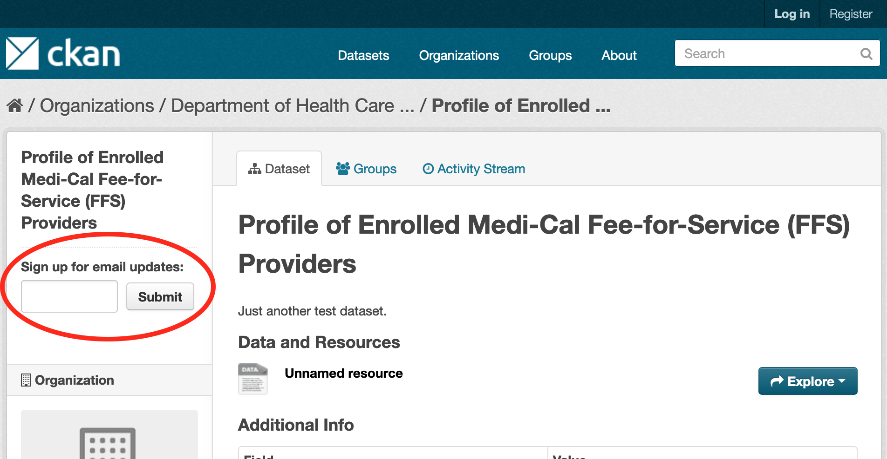

.. You should enable this project on travis-ci.org and coveralls.io to make
   these badges work. The necessary Travis and Coverage config files have been
   generated for you.

.. image:: https://travis-ci.org/davidread/ckanext-subscribe.svg?branch=master
    :target: https://travis-ci.org/davidread/ckanext-subscribe

.. image:: https://coveralls.io/repos/davidread/ckanext-subscribe/badge.svg
  :target: https://coveralls.io/r/davidread/ckanext-subscribe

.. image:: https://img.shields.io/pypi/v/ckanext-subscribe.svg
    :target: https://pypi.org/project/ckanext-subscribe/
    :alt: Latest Version

.. image:: https://img.shields.io/pypi/pyversions/ckanext-subscribe.svg
    :target: https://pypi.org/project/ckanext-subscribe/
    :alt: Supported Python versions

.. image:: https://img.shields.io/pypi/status/ckanext-subscribe.svg
    :target: https://pypi.org/project/ckanext-subscribe/
    :alt: Development Status

.. image:: https://img.shields.io/pypi/l/ckanext-subscribe.svg
    :target: https://pypi.org/project/ckanext-subscribe/
    :alt: License

=================
ckanext-subscribe
=================

CKAN extension that allows users to subscribe to dataset/organization/group
updates WITHOUT requiring them to login.

This feature is complementary to CKAN's existing "Follow" feature, which allows
logged in users to subscribe to get update emails. Log-in can be a barrier to
casual interest in say a handful of datasets. Generating and storing a password
is a burden on the user, and for casual use just using temporary email links,
as in this extension, is more appropriate.

More screenshots: https://github.com/davidread/ckanext-subscribe/tree/master/doc

------------
Requirements
------------

Compatibility with core CKAN versions:

=============== =============
CKAN version    Compatibility
=============== =============
2.6 and earlier no
2.7             yes
2.8             yes
2.9             not yet
=============== =============

------------
Installation
------------

.. Add any additional install steps to the list below.
   For example installing any non-Python dependencies or adding any required
   config settings.

To install ckanext-subscribe:

1. Activate your CKAN virtual environment, for example::

     . /usr/lib/ckan/default/bin/activate

2. Install the ckanext-subscribe Python package into your virtual environment::

     pip install ckanext-subscribe

3. Add ``subscribe`` to the ``ckan.plugins`` setting in your CKAN
   configuration file (by default the config file is located at
   ``/etc/ckan/default/production.ini``).

4. Make sure that ``ckan.site_url`` is set correctly in the ``[app:main]``
   section of your CKAN configuration file. This is used to generate links in
   the bodies of the notification emails. For example::

    ckan.site_url = https://example.com

5. Make sure that ``smtp.mail_from`` is set correctly in the ``[app:main]``
   section of your CKAN configuration file. This is the email address that
   CKAN's email notifications will appear to come from. For example::

    smtp.mail_from = info@example.com

   This is combined with your ``ckan.site_title`` to form the ``From:`` header
   of the email that are sent, for example::

    From: Sunnyville Open Data <info@example.com>

   If you would like to use an alternate reply address, such as a "no-reply"
   address, set ``smtp.reply_to`` in the ``[app:main]``
   section of your CKAN configuration file. For example::

    smtp.reply_to = noreply@example.com

6. If you do not have an SMTP server running locally on the machine that hosts
   your CKAN instance, you can change the ``email-settings`` to send email via
   an external SMTP server. For example, these settings in the ``[app:main]``
   section of your configuration file will send emails using a gmail account
   (not recommended for production websites!)::

    smtp.server = smtp.gmail.com:587
    smtp.starttls = True
    smtp.user = your_username@gmail.com
    smtp.password = your_gmail_password
    smtp.mail_from = your_username@gmail.com

7. Initialize the subscribe tables in the database::

     paster --plugin=ckanext-subscribe subscribe initdb

8. Restart CKAN. For example if you've deployed CKAN with Apache on Ubuntu::

     sudo service apache2 reload

9. You need to run the 'send-any-notifications' command regularly. You can see
   it running on the command-line::

     paster --plugin=ckanext-subscribe subscribe send-any-notifications -c /etc/ckan/default/production.ini

   However instead you'll probably want a cron job setup to run it every minute
   or so. We're going to edit the cron table. On a development machine, just do
   this for your user::

     crontab -e

   Or a production machine use the 'ckan' user, instead of checking for notifications on the
   command-line, create CRON job. To do so, edit the cron table with the
   following command (it may ask you to choose an editor)::

     sudo crontab -e -u ckan

   Paste this line into your crontab, again replacing the paths to paster and the ini file with yours::

     # m h  dom mon dow   command
       * *  *   *   *     /usr/lib/ckan/default/bin/paster --plugin=ckanext-subscribe subscribe send-any-notifications --config=/etc/ckan/default/production.ini

   This particular example will check for notifications every minute.

   Also in this cron you will likely see it also running a paster command for
   `/api/action/send_email_notifications`. This is similar but separate
   functionality, that core CKAN uses to send emails to users that have created
   user accounts e.g. for the 'follower' functionality. There's more about this
   here: https://docs.ckan.org/en/2.8/maintaining/email-notifications.html

---------------
Config settings
---------------

::

  # Email notifications older than this time period will not be sent.
  # So, after a pause in the sending of emails, when it restarts, it will not
  # notify about activity which is:
  # * older than this period, for immediate subscriptions
  # * older than this period + 1 day, for daily subscriptions
  # * older than this period + 1 week, for weekly subscriptions
  # Accepted formats: ‘2 days’, ‘14 days’, ‘4:35:00’ (hours, minutes, seconds),
  #                  ‘7 days, 3:23:34’, etc.
  # See also: https://docs.ckan.org/en/2.8/maintaining/configuration.html#ckan-email-notifications-since
  # (optional, default: ‘2 days’)
  ckan.email_notifications_since = 24:00:00

  # The time that daily and weekly notification subscriptions are sent (UTC
  # timezone)
  ckanext.subscribe.daily_and_weekly_notification_time = 09:00

  # The day of the week that weekly notification subscriptions are sent
  ckanext.subscribe.weekly_notification_day = friday

---------------
Troubleshooting
---------------

**Notification emails not being sent**

1. Check your cron schedule is working::

     tail -f /var/log/syslog | grep subscribe

   You should see messages every minute::

     Jan 10 15:24:01 ip-172-30-3-71 CRON[29231]: (ubuntu) CMD (/usr/lib/ckan/default/bin/paster --plugin=ckanext-subscribe subscribe run --config=/etc/ckan/default/production.ini)

1. Create a test activity for a dataset/group/org you are subscribed to::

     paster --plugin=ckanext-subscribe subscribe create-test-activity mydataset --config=/etc/ckan/default/production.ini

   The log of the cron-activated paster command itself is not currently stored anywhere, so it's best to test it on the commandline::

     paster --plugin=ckanext-subscribe subscribe send-any-notifications --config=/etc/ckan/default/production.ini

   You should see emails being sent to subscribers of that dataset::

     2020-01-06 16:30:40,591 DEBUG [ckanext.subscribe.notification] send_any_immediate_notifications
     2020-01-06 16:30:40,628 DEBUG [ckanext.subscribe.notification] sending 1 emails (immediate frequency)
     2020-01-06 16:30:42,116 INFO  [ckanext.subscribe.mailer] Sent email to david.read@hackneyworkshop.com

1. Clean up all test activity afterwards::

     paster --plugin=ckanext-subscribe subscribe delete-test-activity --config=/etc/ckan/default/production.ini

**NameError: global name 'Subscription' is not defined**

You need to initialize the subscribe tables in the database.  See
'Installation' section above to do this.

**KeyError: "Action 'subscribe_signup' not found"**

You need to enable the `subscribe` plugin in your CKAN config. See
'Installation' section above to do this.

**ProgrammingError: (ProgrammingError) relation "subscription" does not exist**

You're running the tests with `--reset-db` and this extension doesn't work with
that. Instead, if you need to wipe the tables before running tests, do it this
way::

    sudo -u postgres psql ckan_test -c 'drop table if exists subscription; drop table if exists subscribe_login_code; drop table if exists subscribe;'

or simply::

    sudo -u postgres dropdb ckan_test
    sudo -u postgres createdb -O ckan_default ckan_test -E utf-8
    paster --plugin=ckan db init -c ../ckan/test-core.ini

----------------------
Developer installation
----------------------

To install ckanext-subscribe for development, activate your CKAN virtualenv and
do::

    git clone https://github.com/davidread/ckanext-subscribe.git
    cd ckanext-subscribe
    python setup.py develop
    pip install -r dev-requirements.txt

Now continue Installation steps from step 3

-----
Tests
-----

To run the tests, do::

    nosetests --nologcapture --with-pylons=test.ini

To run the tests and produce a coverage report, first make sure you have
coverage installed in your virtualenv (``pip install coverage``) then run::

    nosetests --nologcapture --with-pylons=test.ini --with-coverage --cover-package=ckanext.subscribe --cover-inclusive --cover-erase --cover-tests

--------------------------------------------
Releasing a new version of ckanext-subscribe
--------------------------------------------

ckanext-subscribe should be available on PyPI as https://pypi.org/project/ckanext-subscribe.
To publish a new version to PyPI follow these steps:

1. Update the version number in the ``setup.py`` file.
   See `PEP 440 <http://legacy.python.org/dev/peps/pep-0440/#public-version-identifiers>`_
   for how to choose version numbers.

2. Make sure you have the latest version of necessary packages::

    pip install --upgrade setuptools wheel twine

3. Create a source and binary distributions of the new version::

       python setup.py sdist bdist_wheel && twine check dist/*

   Fix any errors you get.

4. Upload the source distribution to PyPI::

       twine upload dist/*

5. Commit any outstanding changes::

       git commit -a
       git push

6. Tag the new release of the project on GitHub with the version number from
   the ``setup.py`` file. For example if the version number in ``setup.py`` is
   0.0.1 then do::

       git tag 0.0.1
       git push --tags
